# Plan de Mejoras para Dubbing (Multi-Idioma)

> **Status Actual**: 🚀 **PR #71 (staging/dubbing-workflow) abierto para revisión.**
> **Fuente**: Entrevista técnica con equipo de producción (Saúl, Alan) - Dic 2024
> **Contexto**: Análisis Lean del flujo manual en ElevenLabs Dubbing Studio

---

## 🎯 Objetivo
Eliminar el trabajo repetitivo ("Mudas") en el pipeline de doblaje multi-idioma, automatizando las tareas de baja complejidad que actualmente consumen tiempo de Saúl y Alan.

---

## ⚠️ Problemas Identificados (Mudas)

### 1. Re-Mapping de Personajes (Talent Waste)
- **Situación**: Saúl asigna voces "mentalmente" porque conoce el proyecto. Debe re-mapear los mismos personajes en cada idioma.
- **Impacto**: ~5-10 min por proyecto × N idiomas.
- **Cita**: *"Le pongo siempre el primero protagonista... para sacarlo más rápido"*

### 2. Cosecha Manual de Silencios (Extra Processing)
- **Situación**: ElevenLabs no respeta los silencios del audio original; los comprime o estira.
- **Impacto**: Saúl debe cortar manualmente cada silencio para evitar "timing drift".
- **Cita**: *"Si dejamos este espacio... al momento de pasar el inglés se utiliza este tiempo para llenar"*

### 3. Mezcla de Diálogos en Pista Única (Defects)
- **Situación**: ElevenLabs a veces detecta múltiples personajes como uno solo.
- **Impacto**: Saúl debe separar manualmente y reasignar a pistas correctas.
- **Cita**: *"Aquí me mezcló 2 personajes en un mismo diálogo"*

### 4. Bug `no.` → `number` (Defects)
- **Situación**: El punto después de "no" se interpreta como abreviatura de "number".
- **Impacto**: Audio incorrecto que requiere edición manual del texto.
- **Cita**: *"Los no que los pone como nanda, los no cuando le ponen punto pues ya cuenta como number"*

### 5. Filtros de Seguridad por Idioma (Waiting)
- **Situación**: Palabras como "muerte", "sexy" son bloqueadas en ciertos idiomas.
- **Impacto**: Saúl debe cambiar manualmente el texto en español para que traduzca.
- **Cita**: *"La palabra sexy, no es, no me la quiere poner, hay que traducir"*

### 6. Audio "Comido" (Defects)
- **Situación**: ElevenLabs recorta audio más de lo debido, perdiendo sílabas.
- **Impacto**: Detección auditiva manual; Saúl escucha "S arrastrada".
- **Cita**: *"Se había pasado. Nomás lo recorrí para ajustarlo"*

### 7. Falta de Auto-Scroll (UX Friction)
- **Situación**: El editor no sigue la línea de tiempo automáticamente.
- **Impacto**: Saúl debe hacer scroll manual constantemente.
- **Cita**: *"No tiene auto scroll... es algo necesario, yo pienso que sí"*

---

## 🚀 Soluciones Propuestas

### Prioridad Alta (Elimina trabajo repetitivo)

| ID | Mejora | Descripción | Impacto |
|----|--------|-------------|---------|
| **D1** | **Persistencia de Voice IDs** | Guardar mapeo `Personaje → VoiceID` del módulo TTS. Reutilizar automáticamente en Dubbing. | Elimina re-mapping manual |
| **D2** | **Sanitizador de Script** | Regex + LLM ligero para limpiar puntuación ambigua (`no.` → `no`) antes de traducir. | Elimina bug de "number" |
| **D3** | **Diccionario de Palabras Bloqueadas** | Lista por idioma de términos que disparan filtros de seguridad, con sugerencias de sinónimos. | Reduce espera y retrabajo |

### Prioridad Media (Mejora calidad)

| ID | Mejora | Descripción | Impacto |
|----|--------|-------------|---------|
| **D4** | **Detección de Mezcla** | Comparar pistas detectadas vs. personajes esperados. Alertar si hay mismatch. | Previene defectos |
| **D5** | **WER Automático** | Comparar transcripción de ElevenLabs vs. guion original. Marcar segmentos con baja confianza. | Automatiza QA auditivo |
| **D6** | **Doblaje Segmentado (API)** | Enviar escenas individuales con timestamps en lugar de video completo. | Elimina timing drift |

### Prioridad Baja (Nice-to-have)

| ID | Mejora | Descripción | Impacto |
|----|--------|-------------|---------|
| **D7** | **Auto-Scroll en Preview** | Seguir automáticamente la línea de tiempo durante reproducción. | Mejora UX |
| **D8** | **Censores & Filtros** | Escaneo preventivo de palabras bloqueadas (ej. "muerte", "sexy") en ES. | Evita bloqueos por idioma |
| **D9** | **Integración After Effects** | Importar `start_time` / `end_time` de Fer para sync perfecto. | Elimina "Cosecha de Silencios" |
| **D10** | **Inyección por Personaje** | Enviar diálogos separados por orador (Multi-track) a la API. | Evita mezcla de voces |

---

## 🛠️ Mapeo Técnico (Problema ↔ Solución API)

| Problema detectado en Reunión | Solución Técnica (Knowledge Base) | Impacto |
|-------------------------------|-----------------------------------|---------|
| **Cosecha de Silencios** (Muda) | **Manual Dub CSV**: Inyectamos tiempos exactos de After Effects. | **ALTO**: Saúl ya no corta waveforms a mano. |
| **Mezcla de Personajes** | **Voice Segments (v3)**: Definimos orador por bloque de texto. | **ALTO**: Cero "diálogos mezclados" en una pista. |
| **Bug `no.` -> `number`** | **Sanitizador D2**: Limpieza regex en el backend antes de subir. | **MEDIO**: Calidad garantizada. |
| **Filtros de Seguridad** | **Pre-Scanner LLM**: Gemini detecta palabras rojas y sugiere cambios. | **MEDIO**: Menos re-trabajo manual por censura. |
| **Audio "Comido" (Clipping)** | **Fixed Duration + Buffer**: Forzamos duración exacta con margen de respiro. | **ALTO**: No más sílabas cortadas al final. |

---

## 💎 El "Holy Grail" Workflow (Manual Dub Studio)

Si tenemos el proyecto de After Effects, el flujo de "Adivinanza" de ElevenLabs muere y nace el de **Precisión Total**:

### 1. Inyección de Coordenadas Temporales
En lugar de que ElevenLabs "detecte" cuándo habla alguien, le enviamos un **CSV de Coordenadas**:
```csv
speaker,start_time,end_time,transcription
"GABRIEL","0.500","3.200","Mis padres me ofrecieron en Marketplace"
"ELSA","4.100","5.800","¡Lesslie Gabriel Fernández!"
```
**Resultado**: Se eliminan al 100% los clips "comidos" o silencios mal procesados.

### 2. División por Personaje (Multi-Track)
Es el paso ideal. Al enviar pistas separadas o el CSV bien etiquetado, ElevenLabs no tiene que "adivinar" quién es quién.
- **Ventaja**: Cero errores de "Personaje A hablando con voz de Personaje B".

### 3. Editor de Contexto (Pre-Dubbing)
Antes de generar, AI-Studio permite:
- **Sanitizar**: Cambiar `no.` -> `no` (Bug D2).
- **Control Emocional**: Añadir tags de estilo (shouting, whispering) via API.

---

---

## 👥 Flujo Humano Actual (End-to-End)

> **Confirmado por Voice Note**: Este es el proceso real involucrando a los 3 actores clave.

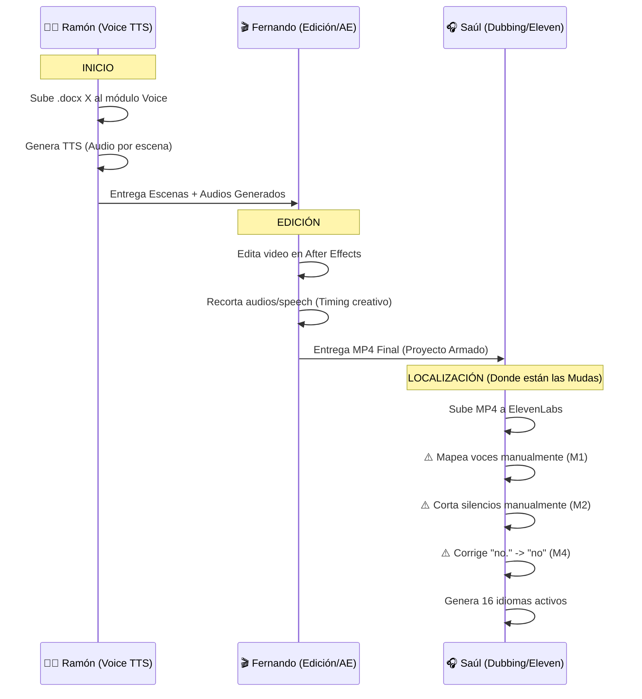

### 🚨 El Reto: "La Caja Negra" de Edición (Time Warp)
**El usuario confirma un detalle crítico**: Fernando no solo ensambla, sino que **altera el audio** (recorta, comprime velocidad, reajusta tiempos).

| Actor | Acción Crítica | Consecuencia para Dubbing |
|-------|----------------|---------------------------|
| **Ramón** | Genera TTS "Puro" | Tiempos perfectos, pero... |
| **Fernando** | ✂️ **Recorta / Comprime Velocidad** | **Rompe los timestamps originales.** La duración del audio de Ramón ya no coincide con el video final. |
| **Saúl** | Recibe MP4 alterado | ElevenLabs intenta "adivinar" sobre un audio acelerado/cortado, causando desincronización y "audio comido". |

### 💡 Soluciones de Arquitectura (Opciones)

#### Opción A (Ideal): "Multi-Track Stems"
Si Fernando puede exportar el audio **separado por personaje** (Stems) en lugar de mezclado:
1.  Ramón entrega por separado (Fácil).
2.  Fernando edita (mantiene pistas separadas).
3.  Fernando exporta `Video_Reference.mp4` + `Audio_Tony.wav` + `Audio_Toquequis.wav`.
4.  **Impacto**: ElevenLabs recibe pistas limpias. CERO errores de "mezcla de personajes".

#### Opción B (Robusta): "Re-Alignment AI"
Si Fernando solo puede entregar un MP4 mezclado:
1.  Tomamos el **Guion Final** (que sí tenemos).
2.  Usamos **Whisper con Timestamps** sobre el MP4 final.
3.  Alineamos *Texto Guion* <-> *Audio MP4* para generar **Nuevos Timestamps Reales**.
4.  Enviamos estos nuevos tiempos a ElevenLabs.

---

## 📋 Flujo Propuesto (Con Soluciones Técnicas)

```
┌─────────────────────────────────────────────────────────────────┐
│                        FLUJO ACTUAL                             │
├─────────────────────────────────────────────────────────────────┤
│ 1. Ramón genera Assets (Voice TTS)                              │
│ 2. Fer edita y recorta (After Effects) -> MP4                   │
│ 3. Saúl recibe MP4 "Caja Negra" y arregla todo manualmente      │
└─────────────────────────────────────────────────────────────────┘

┌─────────────────────────────────────────────────────────────────┐
│                      FLUJO MEJORADO                             │
├─────────────────────────────────────────────────────────────────┤
│ 1. Ramón genera Assets + **METADATA** (Voice ID Mapping JSON)   │
│ 2. Fer edita -> MP4                                             │
│ 3. Saúl sube MP4 + **METADATA** a Módulo Dubbing                │
│    - ✅ Mapeo de voces automático (Heredado de Ramón)           │
│    - ✅ Texto Sanitizado (Inyectado desde .docx original)       │
│    - ⚠️ Alignment automático (El reto técnico real)             │
│ 4. Auditoría Automática (Phase 3) valida el resultado           │
└─────────────────────────────────────────────────────────────────┘

---

## 🔍 Re-Auditoría: Oportunidades de Integración Voice ↔ Dubbing

> **Objetivo**: Reducir la "pérdida de señal" entre lo que Ramón genera (Voice) y lo que Saúl recibe (Dubbing), saltando el "agujero negro" de la edición de video.

### Mudas (Desperdicios) de Interconexión Detectadas

| Componente Perdido | Situación Actual ("Broken Telephone") | Solución Digital Thread | Impacto |
|--------------------|---------------------------------------|-------------------------|---------|
| **Casting de Voces** | Ramón asigna voces -> Fer renderiza video -> Saúl reasigna "a oído". | **JSON Transfer**: El casting de Ramón se exporta y Dubbing lo importa automáticamente. | **Elimina Muda #1** |
| **Corrección de Texto** | Ramón arregla typos en Voice -> Fer renderiza -> Saúl recibe guion viejo y re-corrige. | **Single Source of Truth**: Dubbing jala el texto ÚLTIMO usado en Voice, no el docx inicial. | **Elimina Rework de Texto** |
| **Intención Emocional** | Ramón marca "Gritando" -> Video tiene audio gritando -> Dubbing traduce "plano". | **Style Propagation**: Pasar metadata de estilo (ej. `style: shouting`) a la API de Dubbing. | **Mejora Calidad Actoral** |
| **Silencios Originales** | Ramón tiene duración exacta -> Fer recorta -> Saúl adivina silencios. | **Duration Constraints**: Usar la duración del TTS original como "soft limit" para evitar aceleración excesiva. | **Prevención de "Efecto Ardilla"** |
| **Glosario / Pronunciación** | Ramón define cómo se dice "Xochimilco" -> Eleven aprende -> Saúl re-enseña. | **Pronunciation Dictionary Shared**: Diccionario compartido entre workspace de Voice y Dubbing. | **Consistencia de Marca** |

### 🛠️ Acciones de Mitigación Inmediata

1.  **Botón "Export to Dubbing" en Módulo Voice**:
    *   Genera un `manifest.json` que contiene: Personajes, Voces, Texto Final y Estilos.
    *   Este archivo acompaña al MP4 de Fernando.
2.  **Modo "Import Project" en Módulo Dubbing**:
    *   Saúl sube MP4 + `manifest.json`.
    *   El sistema pre-configura todo el proyecto de ElevenLabs (Voces, Texto, Estilos) antes de empezar.

---

---

## 🔧 Siguientes Pasos

1. **Validar con Saúl/Alan**: ¿Están de acuerdo con las prioridades?
2. **Investigar ElevenLabs Dubbing API**: ¿Soporta timestamps de entrada?
3. **Prototipo D1**: Persistir Voice IDs en AI-Studio y probar reutilización.
4. **Prototipo D2**: Crear sanitizador de puntuación en backend.

---

---

## � El Problema del "Guion Zombie" (Script Drift)
**Usuario confirma**: Fernando recorta, añade y modifica diálogos en After Effects.
*   **Consecuencia**: El `.docx` original (y el JSON de Ramón) está **MUERTO**. Ya no es la verdad absoluta.
*   **Riesgo**: Si usamos el texto de Ramón, doblaremos frases que Fernando borró, o faltarán frases que Fernando añadió.

### 🛡️ Solución: "Transcription-First Architecture"

El MP4 final de Fernando se convierte en la **ÚNICA Fuente de Verdad**.

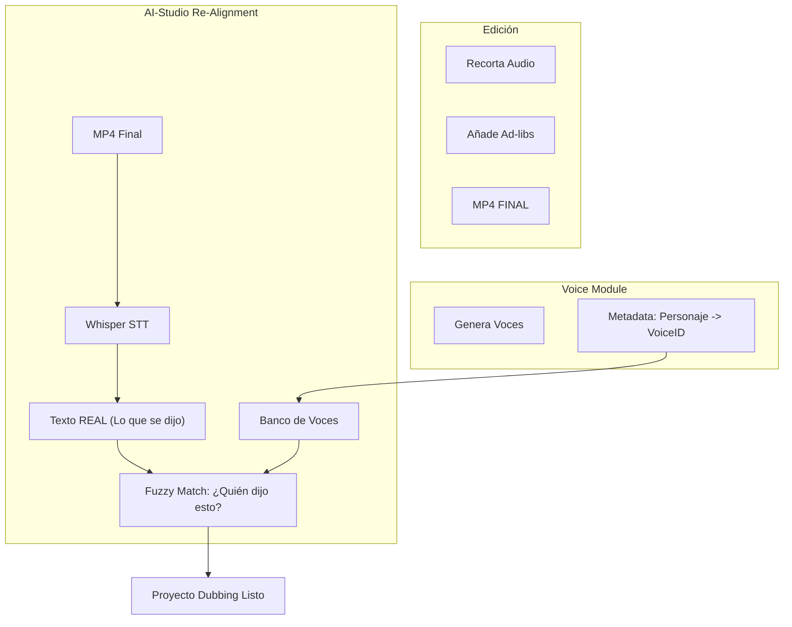

#### Protocolo de Recuperación
1.  **Extracción**: Transcribimos el MP4 Final con Whisper (que da tiempos exactos y texto real).
2.  **Identificación**: Usamos el `manifest.json` de Ramón SOLO para saber "Qué voz tiene Tony".
3.  **Matcheo**:
    *   Whisper dice: "0:45 - ¡No puede ser!"
    *   Sistema busca en JSON de Ramón: ¿Quién tenía una línea parecida? -> Tony.
    *   Asignamos voz de Tony al segmento 0:45.
4.  **Resultado**: Un proyecto de Dubbing con el texto **realmente usado** en el video y las voces correctas.

---

### APIs Disponibles (ElevenLabs)

| API | Endpoint | Uso Potencial |
|-----|----------|---------------|
| **Dubbing** | `POST /v1/dubbing` | Crear proyecto de doblaje con video/audio |
| **Dubbing Resources** | `/v1/dubbing/{id}/resources` | Editar segmentos, speakers, idiomas |
| **Dubbing Transcript** | `/v1/dubbing/{id}/transcript` | Obtener/modificar transcripciones |
| **Studio Projects** | `POST /v1/studio/projects` | Crear proyecto con `from_content_json` estructurado |
| **Forced Alignment** | `POST /v1/forced-alignment` | Verificar timestamps texto ↔ audio |
| **Speech-to-Text** | `POST /v1/speech-to-text` | Transcribir para validación diff |

### Mapeo Muda → API → Implementación

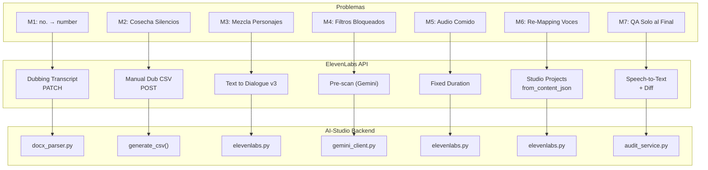

| Muda | API | Endpoint | Archivo Backend | Estado |
|------|-----|----------|-----------------|--------|
| M1: `no.` → `number` | Dubbing Transcript | `PATCH /dubbing/{id}/transcript` | `docx_parser.py` | ✅ Sanitizador |
| M2: Cosecha Silencios | Manual Dub | `POST /dubbing` (CSV mode) | `generate_csv()` | ⏳ Pendiente |
| M3: Mezcla Personajes | Text to Dialogue | `POST /text-to-dialogue` | `elevenlabs.py` | ⏳ Pendiente |
| M4: Re-Asignación Manual | Voice Manifest | `POST /voice/manifest/{id}` | `voice_manifest.py` | ✅ **Entregado (Phase 1)** |
| M5: Audio Desincronizado | Re-Alignment Engine | `POST /dubbing/create-aligned` | `alignment_engine.py` | ✅ **Entregado (Phase 3)** |
| M6: Re-Mapping Voces | Studio Projects | `POST /studio/projects` | `elevenlabs.py` | ✅ Implementado |
| M7: QA Solo al Final | STT + Diff | `POST /speech-to-text` | `audit_service.py` | ⏳ Pendiente |


### Oportunidad Clave: `from_content_json`

La API de Studio Projects permite importar contenido estructurado con **voice_id por nodo**:

```json
// Ejemplo de from_content_json (de ElevenLabs docs)
[
  {
    "name": "Escena 01",
    "blocks": [
      {
        "sub_type": "p",
        "nodes": [
          {"voice_id": "Sam_VoiceID", "text": "Hola mundo", "type": "tts_node"},
          {"voice_id": "Marianita_VoiceID", "text": "¿Qué tal?", "type": "tts_node"}
        ]
      }
    ]
  }
]
```

**Esto significa**: Si AI-Studio exporta los diálogos de Voice TTS en este formato JSON, podemos crear proyectos de Dubbing **con personajes pre-mapeados**, eliminando el trabajo manual de Saúl.

---

## 🎯 Plan de Integración (Propuesto)

### Fase 1: Export desde Voice TTS
**Objetivo**: Generar un JSON estructurado desde el módulo Voice TTS.

```
SceneQueue (Voice TTS) → Export JSON
{
  personajes: [
    { nombre: "Sam", voice_id: "abc123", dialogos: [...] },
    { nombre: "Marianita", voice_id: "def456", dialogos: [...] }
  ],
  escenas: [
    { id: 1, audio_path: "...", start_ms: 0, end_ms: 5000 }
  ]
}
```

**Archivos a modificar**:
- `frontend/app/voice/page.tsx` - Añadir botón "Export for Dubbing"
- `backend/api/voice.py` - Endpoint para exportar JSON estructurado

### Fase 2: Nuevo Módulo Dubbing
**Objetivo**: Interfaz para subir MP4 + JSON de personajes y crear proyecto en ElevenLabs vía API.

**Endpoints nuevos en backend**:
```python
POST /api/dubbing/create
  - video: MP4
  - characters_json: Export de Voice TTS
  - target_languages: ["en", "de", "fr"]

POST /api/dubbing/{project_id}/sync
  - Sincroniza progreso desde ElevenLabs

GET /api/dubbing/{project_id}/export
  - Descarga audio doblado por idioma
```

### Fase 3: Validación Automática
**Objetivo**: Usar Forced Alignment + Speech-to-Text para QA automático.

```
1. Generar audio doblado (ElevenLabs)
2. Transcribir audio generado (Speech-to-Text)
3. Comparar transcripción vs. texto original (WER Score)
4. Marcar segmentos con confianza < 85%
```

---

## 📊 Beneficios Esperados

| Mejora | Antes | Después | Ahorro |
|--------|-------|---------|--------|
| Mapeo de personajes | ~10 min/proyecto | 0 (automático) | 100% |
| Detección de errores | Manual (auditivo) | Automático (WER) | ~80% |
| Re-procesamiento por idioma | Repetir mapeo | Heredar de ES | 100% |

---

## 📚 Referencias
- Knowledge Item: `voice_and_multilingual_audio_engineering`
- Análisis Lean: `/multilingual_pipeline/lean_analysis.md`
- Plan TTS Existente: `PLAN_MEJORAS_TTS.md`
- **ElevenLabs API Docs**:
  - [Dubbing API](https://elevenlabs.io/docs/api-reference/dubbing/create)
  - [Studio Projects](https://elevenlabs.io/docs/api-reference/studio/add-project)
  - [Forced Alignment](https://elevenlabs.io/docs/api-reference/forced-alignment/create)

---

## ✅ PROGRESO DE IMPLEMENTACIÓN (Actualizado: Dic 2024)

### 📊 Resumen de Estado

| Etapa del Pipeline | Componentes | Estado | Notas |
|--------------------|-------------|--------|-------|
| **1. PRE-PRODUCCIÓN** | Sanitizador, Parsing Script .docx | ✅ **COMPLETADO** | `docx_parser.py` maneja limpieza básica |
| **2. PRODUCCIÓN** | API Dubbing, Studio Projects | ✅ **COMPLETADO** | `dubbing.py` + `elevenlabs.py` integrados |
| **3. POST-PRODUCCIÓN** | Auditoría, QA, WER Automático | ❌ **PENDIENTE** | Solo existe diseño en `VALIDATION_FLOW_TIERING.md` |

### 🛠️ Detalle Técnico por Componente

#### ✅ IMPLEMENTADO (Funcional)

| Componente | Archivo Principal | Función Real |
|------------|-------------------|--------------|
| **Backend Dubbing** | `backend/api/dubbing.py` | CRUD, Cache (TTL 60s), Upload Video/Script |
| **ElevenLabs Client** | `services/elevenlabs.py` | Wrapper Async para API v1 (Dubbing + Studio) |
| **Voice Mapping** | `/api/dubbing/import-mappings` | Reutiliza mapeo `Personaje -> VoiceID` de TTS |
| **Script Parser** | `services/docx_parser.py` | Lee `.docx`, extrae personajes, sanitiza `no.`->`no` |
| **Frontend UI** | `app/dubbing/page.tsx` | Tabs (Video/Script), Selector Idiomas, Status Badge |

#### ❌ NO IMPLEMENTADO (Solo Diseño)

| Componente Faltante | Dependencia Técnica | Impacto de Ausencia |
|---------------------|---------------------|---------------------|
| **Sistema de Auditoría** | `audit_service.py` | QA sigue siendo 100% manual (sin WER, sin validación) |
| **Dual STT** | Whisper + Gemini API | No hay "segunda opinión" para el audio generado |
| **Blacklist Preventiva** | `prompt_scanner.py` | Palabras prohibidas (ej. "muerte") rompen la generación |
| **Sync After Effects** | `import_csv_timings` | Saúl debe cortar silencios a mano (Muda #2) |
| **Detection de Mezcla** | `validate_speakers` | Posible mezcla de voces en una misma pista |

### ⚠️ AVISO DE GAP
El **Anexo A** (Sistema de Auditoría) es actualmente una **Propuesta de Diseño**. No existe código ejecutándose para validación de calidad.
Para completar la visión "Zero Manual Work", se requiere iniciar la **Fase 3: Quality Assurance Automation**.

---

## 🔜 Próximos Pasos

1. **Reiniciar Backend** (`python main.py`)
2. **Probar flujo completo** en UI (`/dubbing` > Tab Script)
3. **Fase 3: Validación Automática** (WER / Sync)

---

## ⏱️ Estimación de Ahorros

**Basado en guion típico (347 diálogos, ~42K caracteres):**

| Escenario | Tiempo Manual | Tiempo Automatizado | Ahorro |
|-----------|---------------|---------------------|--------|
| ES → EN | ~40 min | ~5 min | **87%** |
| 16 idiomas activos | ~4.5 hrs | ~40 min | **85%** |

**Regla de pulgar:**
- Manual: ~4-5 min trabajo / min video
- Automatizado: ~0.5 min trabajo / min video

---

## 🔮 Ideas Futuras / Lluvia de Ideas

### 2. Integración Directa: Voice TTS → Dubbing 🔗
**Problema actual:** Se requiere generar audio en Voice TTS, manejar un archivo intermedio (docx) y subirlo manualmente a Dubbing.
**Mejora:**
- Agregar botón "Exportar a Dubbing" en el módulo Voice TTS.
- Transferir guion y asignación de voces automáticamente.
**Impacto:** Elimina fricción de archivos intermedios para usuarios que ya trabajan en la plataforma.

### 3. Check de Calidad Automático (WER) 🛡️
**Problema actual:** ElevenLabs ocasionalmente omite palabras o pronuncia mal, requiriendo revisión auditiva completa.
**Mejora:**
- Usar Speech-to-Text para transcribir el audio generado.
- Comparar transcripción vs guion original (Word Error Rate).
- Resaltar discrepancias (ej. "no" vs "number").
**Impacto:** Reduce tiempo de revisión manual, focalizando solo en alertas rojas.

### 4. "Casting" Persistente (Memoria de Personajes) 🧠
**Problema actual:** Saúl mapea voces "de memoria" y tiene que re-asignarlas en cada idioma.
**Cita:** *"Para que no se me olviden... a la hora de ponerlos, luego como le voy a prestar también los idiomas"*
**Mejora:**
- Guardar un "Casting" por proyecto/serie con `Personaje → VoiceID`.
- Auto-rellenar cuando se detecte el mismo personaje en Cap 2, 3, etc.
**Impacto:** Elimina re-mapping por idioma (el ticket que ya mandaron a ElevenLabs).

### 5. Detección Automática de Silencios 🔇
**Problema actual:** Saúl corta silencios manualmente observando el waveform.
**Cita:** *"Nomás es visual... a la mitad del silencio"*
**Mejora:**
- Usar detección de VAD (Voice Activity Detection) en backend.
- Pre-marcar silencios y sugerir cortes automáticos.
**Impacto:** Elimina el trabajo visual de "cosechar silencios".

### 6. Text-to-Dialogue API (Eleven v3) 🎭
**Problema actual:** Se usa TTS tradicional por personaje; ElevenLabs detecta mal múltiples voces.
**Cita:** *"Aquí me mezcló 2 personajes en un mismo diálogo"*
**Mejora:**
- Usar la nueva API `Text-to-Dialogue` de Eleven v3 que maneja múltiples personajes.
- Permite definir personaje + diálogo + emoción en un solo request.
**Impacto:** Elimina mezcla de personajes; mejor control emocional.

### 7. Diccionario de Palabras Bloqueadas 🚫
**Problema actual:** Palabras como "muerte", "sexy" son bloqueadas en ciertos idiomas.
**Cita:** *"La palabra sexy, no es, no me la quiere poner"*
**Mejora:**
- Mantener diccionario por idioma de términos bloqueados + sinónimos sugeridos.
- Pre-escanear guion y alertar ANTES de enviar a ElevenLabs.
**Impacto:** Previene errores en lugar de corregirlos después.

### 8. Alerta de Compresión/Velocidad ⚡
**Problema actual:** Diálogos largos se comprimen y se pronuncian muy rápido.
**Cita:** *"Como es mucha información la trata de hacer lo más rápido posible"*
**Mejora:**
- Calcular ratio caracteres/duración esperada.
- Alertar si un diálogo excede umbral (ej. >15 chars/seg).
- Sugerir separar en dos líneas.
**Impacto:** Previene audio acelerado o ininteligible.

---

# 📎 ANEXO A: Sistema de Auditoría de Calidad Multi-Servicio

> **Objetivo**: Garantizar la calidad de las traducciones mediante validación cruzada automatizada usando múltiples servicios de IA (Gemini + Whisper), reduciendo la revisión manual a solo segmentos con alertas.

---

## A.1 Arquitectura General

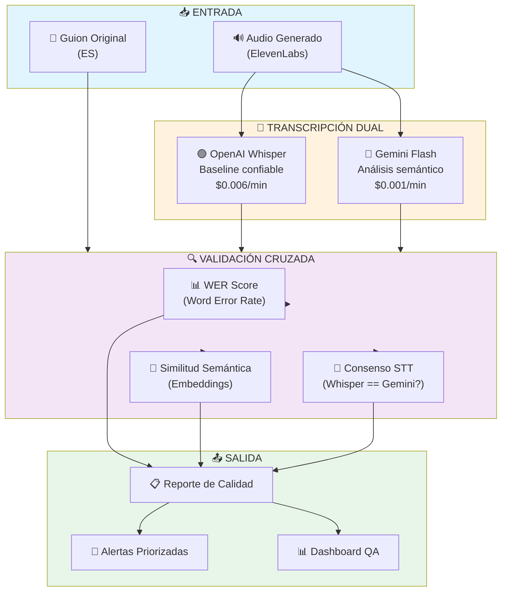

---

## A.2 Pipeline de Procesamiento por Idioma

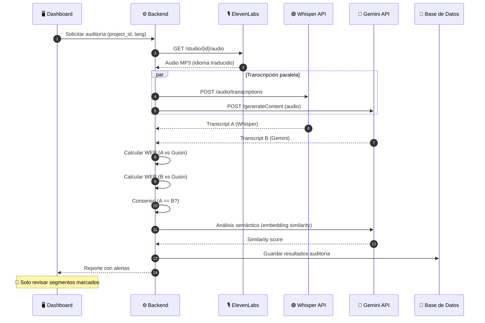

---

## A.3 Niveles de Confianza y Alertas

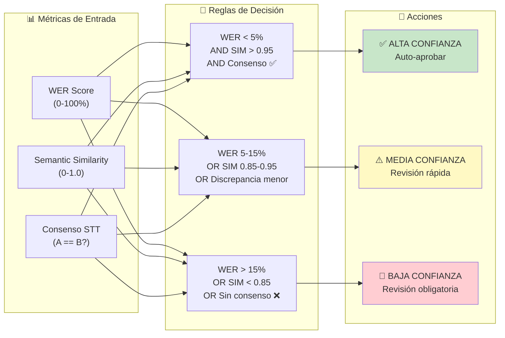

---

## A.4 Detección de Problemas Específicos

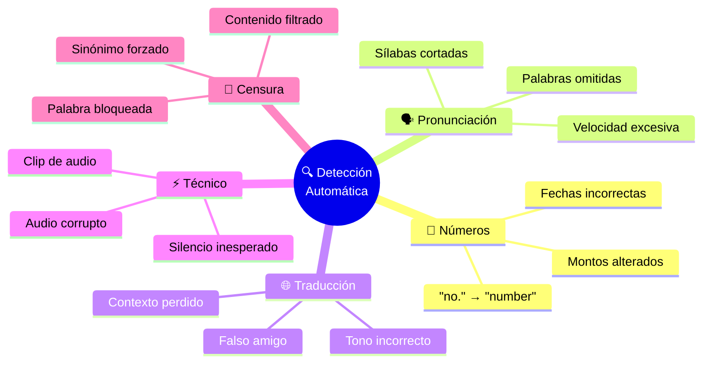

---

## A.5 Modelo de Datos

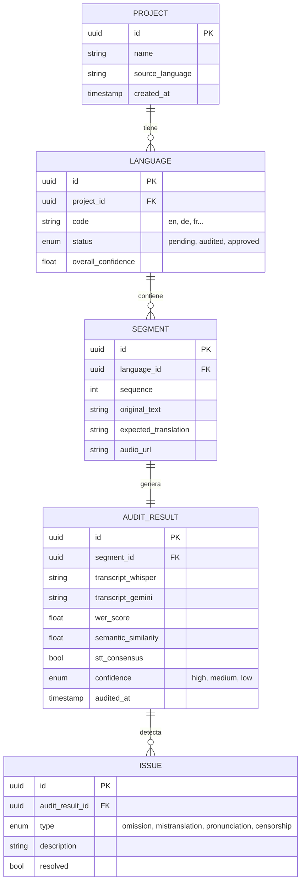

---

## A.6 Estimación de Costos por Proyecto

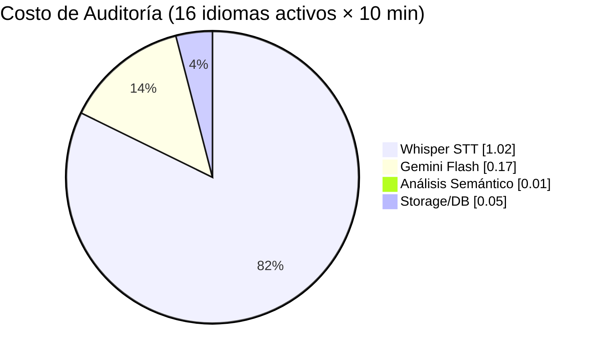

| Componente | Fórmula | Ejemplo (16 idiomas activos × 10 min) |
|------------|---------|-------------------------------|
| **Whisper** | `min × $0.006` | 170 min × $0.006 = **$1.02** |
| **Gemini STT** | `min × $0.001` | 170 min × $0.001 = **$0.17** |
| **Gemini Análisis** | `tokens × $0.075/1M` | ~50K tokens = **$0.004** |
| **Total** | | **~$1.20/proyecto** |

> **ROI**: Si una revisión manual toma 4 hrs ($60-80), y la auditoría automática reduce a 30 min ($7-10), el ahorro es **~$50/proyecto**.

---

## A.7 Endpoints API Propuestos

```
# --- Auditoría de Calidad ---

POST /api/dubbing/audit/{project_id}
    Params: language_code (opcional, si no se pasa audita todos)
    Response: { job_id, languages_queued }

GET /api/dubbing/audit/{project_id}/status
    Response: {
        progress: 75%,
        languages_completed: ["en", "de"],
        languages_pending: ["fr", "it"]
    }

GET /api/dubbing/audit/{project_id}/report
    Response: {
        overall_confidence: 0.92,
        segments: [
            { id, confidence: "high", issues: [] },
            { id, confidence: "low", issues: ["omission detected"] }
        ]
    }

GET /api/dubbing/audit/{project_id}/issues
    Params: severity (low, medium, high), resolved (bool)
    Response: Lista de issues priorizados para revisión

POST /api/dubbing/audit/{segment_id}/resolve
    Body: { issue_id, resolution_note }
    Response: { success: true }
```

---

## A.8 Roadmap de Implementación

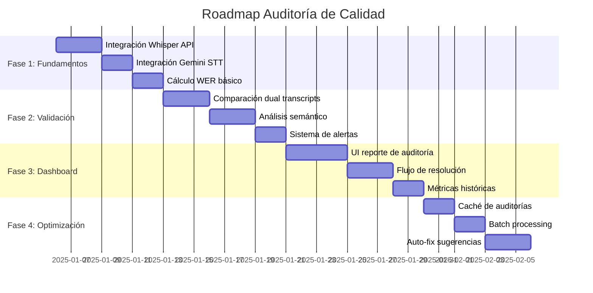

---

## A.9 Flujo de Revisión para el Editor

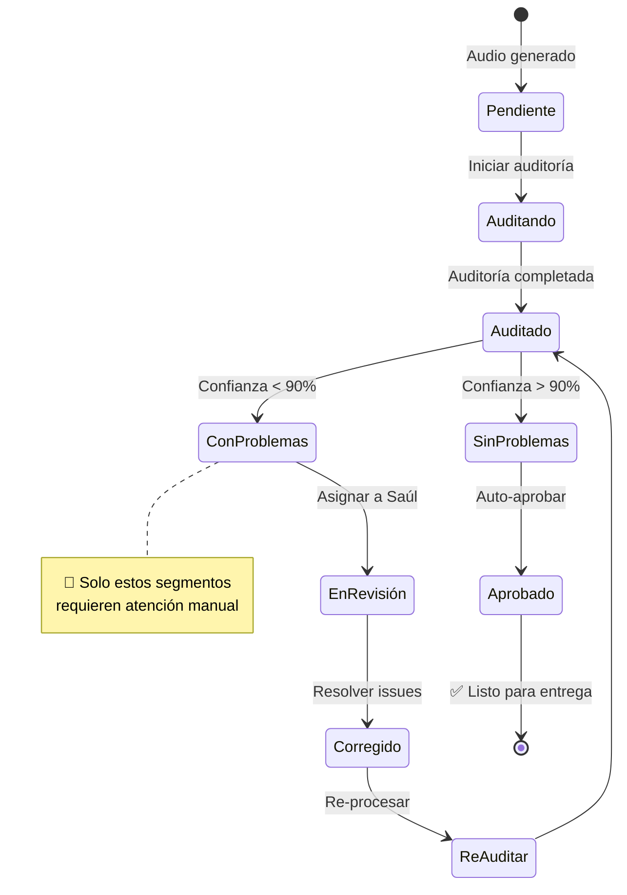

---

## A.10 Ejemplo de Reporte de Auditoría

```json
{
  "project_id": "abc123",
  "project_name": "Serie XYZ - Cap 01",
  "audit_date": "2025-01-15T14:30:00Z",
  "languages_audited": 17,
  "overall_stats": {
    "total_segments": 347,
    "high_confidence": 312,
    "medium_confidence": 28,
    "low_confidence": 7
  },
  "issues_summary": {
    "omissions": 3,
    "mistranslations": 2,
    "pronunciation": 1,
    "censorship": 1
  },
  "attention_required": [
    {
      "segment_id": "seg_045",
      "language": "de",
      "original": "No puedo creer que se haya ido",
      "transcript_whisper": "Ich kann nicht glauben dass er gegangen",
      "transcript_gemini": "Ich kann nicht glauben dass er weg ist",
      "issue": "STT desacuerdo - requiere verificación",
      "confidence": 0.72
    },
    {
      "segment_id": "seg_123",
      "language": "fr",
      "original": "La muerte llegó silenciosa",
      "transcript_whisper": "La [CENSURÉ] arriva silencieuse",
      "issue": "Palabra 'mort' bloqueada por filtro",
      "confidence": 0.45
    }
  ],
  "estimated_review_time": "15 min",
  "cost": {
    "whisper": 1.02,
    "gemini": 0.18,
    "total": 1.20
  }
}
```

---

## A.11 Consideraciones Técnicas

### Servicios Soportados

| Servicio | Endpoint | Idiomas | Latencia | Costo |
|----------|----------|---------|----------|-------|
| **OpenAI Whisper** | `api.openai.com/v1/audio/transcriptions` | 100+ | ~2s/min | $0.006/min |
| **Gemini Flash** | `generativelanguage.googleapis.com` | 100+ | ~1s/min | $0.001/min |
| **Deepgram** (alternativa) | `api.deepgram.com/v1/listen` | 36 | <1s/min | $0.0043/min |
| **ElevenLabs STT** | `api.elevenlabs.io/v1/speech-to-text` | 29 | ~3s/min | Incluido |

### Umbrales Configurables

```python
# config/audit_settings.py
AUDIT_CONFIG = {
    "wer_thresholds": {
        "high_confidence": 0.05,    # < 5% errores
        "medium_confidence": 0.15,  # 5-15% errores
        "low_confidence": 0.15      # > 15% errores
    },
    "semantic_similarity": {
        "high": 0.95,
        "medium": 0.85,
        "low": 0.85
    },
    "auto_approve": True,           # Auto-aprobar alta confianza
    "parallel_languages": 4,        # Procesar 4 idiomas simultáneos
    "cache_ttl_hours": 24           # Caché de resultados
}
```

---

> **Nota**: Este anexo define la arquitectura para auditoría de calidad. La implementación requiere claves API de Whisper y Gemini configuradas en el sistema.
