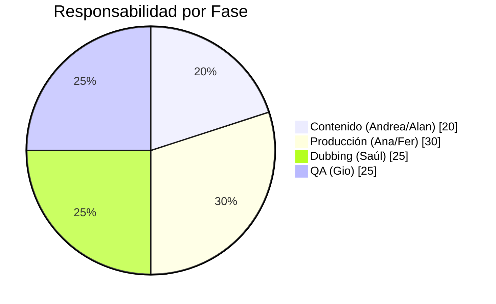

# 🤝 Plan de Stakeholders y Compromisos del Pipeline Dubbing

> **Proyecto:** Dubbing Multi-Idioma "Que Perro Hilo"
> **Objetivo:** Definir roles, compromisos y expectativas de mejora por participante.
> **Enfoque:** Eficiencia ⚡ + Calidad 🎯 + Satisfacción Usuario 💜

---

## 📊 Matriz RACI

| Fase del Pipeline | Ana (Post) | Alan/Ramón (Proyecto) | Fernando (Voice) | Saúl (Dubbing) | Andrea (Sitio) | Gio (QA) |
|---|---|---|---|---|---|---|
| Guión & Contenido | I | A | C | I | R | I |
| Generación Voces (Voice TTS) | I | C | R | I | I | C |
| Sonorización Final | A | C | R | I | C | I |
| Dubbing Multi-idioma | I | I | C | R | I | C |
| Quality Check Final | C | A | I | C | C | R |
| Publicación | I | A | I | I | R | C |

> **R** = Responsable (Ejecuta), **A** = Accountable (Decide/Aprueba), **C** = Consultado, **I** = Informado

---

## 👥 Compromisos por Stakeholder

### 🎬 Ana - Coordinadora Post-Producción

| Área | Compromiso | Métrica de Éxito |
|---|---|---|
| **Coordinación** | Asegurar que Fer entregue MP4 + Guión estructurado | 100% entregas con metadata |
| **Timing Data** | Gestionar que los proyectos de After Effects incluyan timestamps por escena | Cero retrabajos de timing manual |
| **Escalamiento** | Alertar cuellos de botella antes de que bloqueen a Saúl | Lead time < 24h por video |

> **Qué espero de Ana:** Que se convierta en el "Traffic Controller" del pipeline. Que ningún video llegue a Dubbing sin la información necesaria (guión, tiempos, personajes).

---

### 👔 Alan & Ramón - Líderes de "Que Perro Hilo"

| Área | Compromiso | Métrica de Éxito |
|---|---|---|
| **Decisiones de Marca** | Aprobar Glossario de términos "Do Not Translate" | Lista firmada en 1 semana |
| **Priorización de Idiomas** | Definir el orden de los 26 idiomas por ROI | Tier 1 (EN, PT, DE) primero |
| **Budget** | Asignar presupuesto para revisores nativos (Tier 2/3) | ≥1 revisor por idioma Tier 2 |

> **Qué espero de Alan/Ramón:** Que tomen las decisiones de negocio que la IA no puede. "¿Prioritizamos Japonés o Árabe primero?" Eso es suyo.

---

### 🎙️ Fernando - Sonorización (Voice TTS)

| Área | Compromiso | Métrica de Éxito |
|---|---|---|
| **Calidad de Audio Base** | Entregar MP4 sin ruido de fondo, voces limpias | 0 rechazos por calidad audio |
| **Estructura de Proyecto** | Exportar EDL/XML con timestamps por diálogo | Archivo adjunto en cada entrega |
| **Consistencia de Voces** | Usar Voice IDs consistentes de AI-Studio | Cero re-mapeos manuales en Dubbing |

> **Qué espero de Fer:** Que su entrega sea "plug-and-play" para Saúl. Si Fer exporta bien, Saúl no tiene que cortar silencios a mano.

---

### 🌐 Saúl - Operador de Dubbing

| Área | Compromiso | Métrica de Éxito |
|---|---|---|
| **Detección de Bugs** | Reportar TODOS los errores de ElevenLabs (ej. "no" → "number") | → Feed de bugs a AI-Studio |
| **Validación EN** | Revisión 100% del audio en Inglés antes de derivar | 0 errores pasados a Tier 2 |
| **Feedback Loop** | Proponer mejoras al workflow cada Sprint | 1 mejora documentada/semana |

> **Qué espero de Saúl:** Que pase de "Operador manual" a "Supervisor de calidad". AI-Studio hará el trabajo pesado, él valida y mejora.

---

### 📝 Andrea - Líder de Sitio & Contenido

| Área | Compromiso | Métrica de Éxito |
|---|---|---|
| **Calidad de Guión** | Entregar guiones en formato estructurado (Personaje + Diálogo) | Template Google Docs aprobado |
| **Glosario de Marca** | Definir cómo se traducen/adaptan los términos clave | Archivo `glossary_global.json` |
| **Aprobación Final** | Firma de "Go Live" en videos traducidos | SLA: 24h después de QA |

> **Qué espero de Andrea:** Que sea la "dueña de la verdad" del guión. Si Andrea aprueba el texto, ese es EL texto. Cero cambios después.

---

### ✅ Gio - Quality Assurance (QA)

| Área | Compromiso | Métrica de Éxito |
|---|---|---|
| **Definición de Criterios** | Crear checklist de QA por idioma (pronunciación, timing, tono) | Documento público en 2 semanas |
| **Muestreo Tier 2/3** | Revisar 10% de videos en idiomas sin revisor nativo | Reporte semanal de hallazgos |
| **Métricas de Calidad** | Implementar WER automático en AI-Studio | Dashboard operando en Fase 2 |

> **Qué espero de Gio:** Que defina "qué significa calidad" en números. Sin métricas, no podemos mejorar.

---

## 📈 Metas Colectivas

| Meta | Baseline (Hoy) | Target (Q1 2025) | Responsable Principal |
|---|---|---|---|
| Tiempo por video (26 idiomas) | ~4.5 hrs | < 1 hr | Saúl + AI-Studio |
| Errores de sync | Frecuentes | 0 | Fer + Ana |
| Cobertura de QA | 1 idioma (EN) | 100% (Automático) | Gio + AI-Studio |
| Satisfacción audiencia YT | Desconocida | Retention +10% | Alan/Ramón |

---

## 🗓️ Próximos Pasos (Compromisos Inmediatos)

| Quién | Acción | Fecha Límite |
|---|---|---|
| **Andrea** | Entregar template de guión estructurado | 2025-01-03 |
| **Alan/Ramón** | Aprobar lista de términos "Do Not Translate" | 2025-01-06 |
| **Fer** | Entregar 1 video con EDL de timestamps de prueba | 2025-01-10 |
| **Gio** | Publicar checklist de QA v1.0 | 2025-01-08 |
| **Saúl** | Documentar top 5 errores más frecuentes de ElevenLabs | 2025-01-03 |
| **Ana** | Implementar proceso de "Entrega Completa" (MP4 + Guión + Tiempos) | 2025-01-15 |

---

## 📎 Referencias

*   [README del Módulo](../README.md)
*   [PLAN Maestro](../PLAN.md)
*   [Cuestionario Fase 2](./lean_analysis/research/QUESTIONNAIRE_BRIEFING.md)
