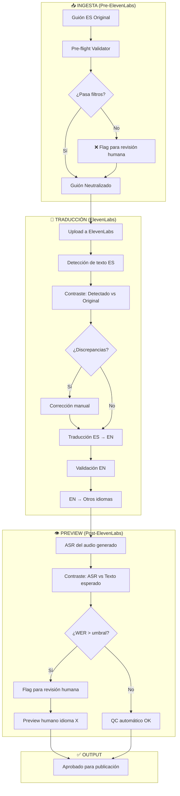

# Flujo de Validación y Tiering - Multi-Idiomas

> **Estado:** Propuesta inicial
> **Prioridad:** Calidad > Costo (en esta etapa)
> **Audiencia Target:** Niños 8-15 años (Avatar: Noha Williams, 10 años)

---

## 1. Content Filters: Criterios de Contenido Prohibido

### 🔴 Categoría A: Prohibido Absoluto (Zero Tolerance)
Contenido que **NUNCA** debe aparecer en ningún idioma:

| Tipo | Ejemplos | Detección |
|------|----------|-----------|
| **Sexual/Romántico explícito** | Besos apasionados, insinuaciones, "novio/a" en contexto romántico adulto | LLM Judge + Keywords |
| **Violencia gráfica** | Sangre detallada, descripciones de heridas, muerte explícita | LLM Judge |
| **Groserías fuertes** | F-words, insultos raciales, slurs en cualquier idioma | Keyword blocklist |
| **Sustancias** | Drogas, alcohol glorificado, cigarros | Keyword blocklist |
| **Self-harm** | Referencias a autolesión, suicidio | LLM Judge + Keywords |

### 🟡 Categoría B: Requiere Contexto (Suavizar)
Contenido que puede existir pero debe ser **neutro/suavizado**:

| Tipo | Problemático | Aceptable |
|------|--------------|-----------|
| **Insultos menores** | "idiota", "estúpido" | "tonto", "bobo" |
| **Agresión verbal** | "te odio" | "estoy muy enojado contigo" |
| **Miedo intenso** | "voy a morir" | "esto es aterrador" |
| **Bullying** | Burla sostenida | Situación de injusticia (para resolverse) |

### 🟢 Categoría C: Permitido con Cuidado
Contenido aceptable para la audiencia pero que requiere **intención clara**:

| Tipo | Notas |
|------|-------|
| **Drama familiar** | Peleas, malentendidos - CORE del contenido (Noha vive esto) |
| **Injusticia** | Maestros injustos, padres que no entienden - motor narrativo |
| **Tensión emocional** | Llorar, gritar de frustración - auténtico para 8-15 años |
| **Suspenso** | Misterio, peligro implícito - sin gore |

---

## 2. Flujo de Validación por Etapas



---

## 3. Tiering de Validaciones

Dado que **calidad > costo** en esta etapa, proponemos un tiering agresivo:

### Tier 1: Validación Máxima (100% revisión humana)
**Idiomas:** Inglés (EN), Portugués (PT-BR), Francés (FR), Alemán (DE)

| Checkpoint | Método | Responsable |
|------------|--------|-------------|
| Pre-flight ES | LLM Judge + Keywords | Automático |
| Contraste ES detectado vs original | Diff automático | Automático |
| Traducción ES→EN | Revisión línea por línea | Saúl/Iván |
| Preview EN audio | Escucha completa | Saúl/Iván |
| Traducción EN→{PT,FR,DE} | Muestreo 30% + métricas | Automático + Humano |
| Preview {PT,FR,DE} audio | Muestreo crítico (intro, climax, final) | Revisor nativo o bilingüe |

### Tier 2: Validación Media (Muestreo inteligente)
**Idiomas:** Árabe (AR), Coreano (KO), Japonés (JA), Hindi (HI), Chino Mandarín (ZH)

| Checkpoint | Método | Responsable |
|------------|--------|-------------|
| Pre-flight ES | LLM Judge + Keywords | Automático |
| Contraste ES detectado vs original | Diff automático | Automático |
| Traducción EN→X | Solo métricas automáticas (COMET, BERTScore) | Automático |
| Preview audio | Solo segmentos flaggeados por métricas | Automático + Humano si flagged |
| ASR Post-dubbing | WER check automático | Automático |

### Tier 3: Validación Mínima (Solo automático)
**Idiomas:** Filipino (FIL), Indonesio (ID), Italiano (IT), Ruso (RU), Turco (TR), Tamil (TA), Malay (MS)

| Checkpoint | Método | Responsable |
|------------|--------|-------------|
| Pre-flight ES | LLM Judge + Keywords | Automático |
| Traducción EN→X | Métricas automáticas | Automático |
| ASR Post-dubbing | WER check | Automático |
| Flag para revisión | Solo si metrics < umbral | Escalado a humano |

---

## 4. Checkpoints Detallados por Etapa

### 4.1 INGESTA: Pre-flight Validator

```
ENTRADA: Guión ES (Español LATAM Neutro)
VALIDACIONES:
  1. Keyword scan (blocklist global)
  2. LLM Judge: Safety check (Categoría A y B)
  3. Neutralización: Mexicanismos → Español global
  4. Timing estimation: ¿Frases muy largas para escenas?
SALIDA:
  - Guión neutralizado
  - Changelog de cambios
  - Flags de riesgo (si hay)
```

### 4.2 TRADUCCIÓN: Contraste Detectado vs Original

```
ENTRADA:
  - Guión ES original (texto)
  - Texto detectado por ElevenLabs (ASR interno)
VALIDACIONES:
  1. Diff línea por línea
  2. Detección de onomatopeyas perdidas ("¡Ay!", "¡Pum!")
  3. Detección de números/palabras malinterpretadas ("no" → "number")
  4. Detección de pronombres incorrectos
SALIDA:
  - Reporte de discrepancias
  - Texto corregido para usar en traducción
ACCIÓN: Si discrepancias > umbral → revisión humana obligatoria
```

### 4.3 TRADUCCIÓN: Validación ES → EN

```
ENTRADA: Texto ES + Traducción EN (de ElevenLabs)
VALIDACIONES:
  1. LLM Judge: ¿Mantiene intención? ¿Tono apropiado 8-15?
  2. COMET score (fidelidad semántica)
  3. Keyword check: ¿Apareció grosería que no estaba en ES?
  4. Timing check: ¿EN es >20% más largo/corto que ES?
SALIDA:
  - Score de calidad (0-100)
  - Flags específicos por línea
  - Sugerencias de corrección
ACCIÓN: EN es MÁSTER → requiere aprobación humana 100%
```

### 4.4 PREVIEW: Post-dubbing QC

```
ENTRADA:
  - Audio generado (MP3/MP4)
  - Texto esperado (traducción aprobada)
VALIDACIONES:
  1. ASR (Whisper) del audio generado
  2. WER (Word Error Rate): ASR vs Texto esperado
  3. Detección de alucinaciones (palabras que no deberían estar)
  4. Detección de omisiones (palabras faltantes)
SALIDA:
  - WER score
  - Lista de discrepancias
  - Timestamp de segmentos problemáticos
ACCIÓN:
  - WER < 5%: Aprobado automático
  - WER 5-15%: Muestreo humano
  - WER > 15%: Revisión humana obligatoria
```

---

## 5. Keyword Blocklist Structure (Propuesta)

```json
{
  "global": {
    "category_a_absolute": [
      "fuck", "shit", "puta", "mierda", "chingar",
      "kill yourself", "suicide", "drugs"
    ],
    "category_b_soften": [
      {"find": "idiota", "replace": "tonto"},
      {"find": "estúpido", "replace": "bobo"},
      {"find": "te odio", "replace": "estoy muy enojado"}
    ]
  },
  "by_language": {
    "en": {
      "category_a": ["f*ck", "sh*t", "damn", "hell"],
      "safe_slang": ["no way", "cool", "awesome", "dude"]
    },
    "pt-br": {
      "category_a": ["porra", "caralho", "foder"],
      "safe_slang": ["maneiro", "dahora", "legal"]
    }
  }
}
```

---

## 6. Métricas Clave (KPIs)

| Métrica | Target | Justificación |
|---------|--------|---------------|
| **% videos con revisión humana** | 100% Tier 1, >30% Tier 2 | Calidad > Costo |
| **WER promedio post-dubbing** | < 10% | Fidelidad de audio |
| **Tiempo detección → corrección** | < 2h Tier 1 | Rapidez de feedback |
| **Flags Category A detectados** | 0 en publicación | Zero tolerance |
| **COMET score promedio** | > 0.85 | Fidelidad semántica |

---

## 7. Costo Estimado del Pipeline de Validación

> **Nota:** Estos son costos ADICIONALES al proceso actual de ElevenLabs.

| Componente | Costo por video (~5 min) | Frecuencia |
|------------|--------------------------|------------|
| LLM Judge (Pre-flight) | ~$0.05-0.10 | 1x por video |
| LLM Judge (ES→EN validation) | ~$0.10-0.20 | 1x por video |
| ASR (Whisper) post-dubbing | ~$0.02-0.05 por idioma | 16 idiomas activos = ~$0.50 |
| COMET/BERTScore | ~$0.01-0.02 por idioma | 16 idiomas activos = ~$0.25 |
| **Total automático** | **~$1-2 por video** | |
| Revisión humana Tier 1 | Tiempo interno equipo | Variable |

**Trade-off aceptado:** ~$1-2 extra por video para garantizar calidad.

---

## Próximos Pasos

- [ ] Definir blocklist inicial (20-30 términos Categoría A)
- [ ] Implementar Pre-flight Validator (LLM Judge)
- [ ] Configurar contraste guión vs texto detectado
- [ ] Definir umbrales de WER por tier
- [ ] Documentar checklist de revisión humana para Tier 1
