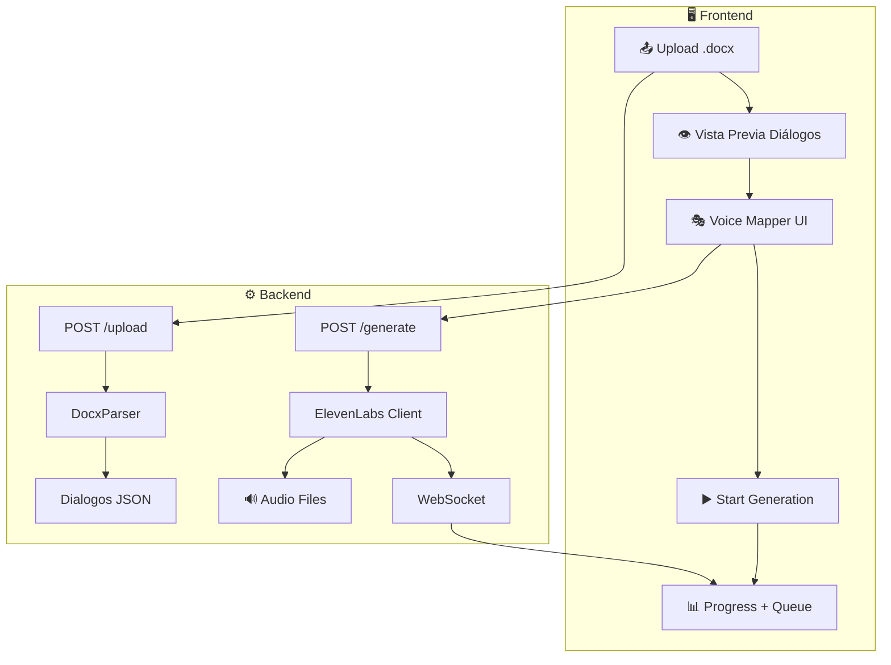

# Voice TTS Module - Plan de Implementación

Nuevo módulo para AI-Studio que automatiza la generación de audio (TTS) para guiones de video usando ElevenLabs API. Integra el proceso actual del usuario (scripts Python) en una GUI moderna.

## Decisiones Pendientes

> [!IMPORTANT]
> **API Key de ElevenLabs**: Definir si la key se guarda en configuración del servidor (`config.py`) o que cada usuario la ingrese en la UI.

---

## Arquitectura



---

## Archivos a Crear/Modificar

### Backend - Services
| Archivo | Descripción |
|---------|-------------|
| `services/elevenlabs.py` | Cliente async para ElevenLabs API |
| `services/docx_parser.py` | Extractor de diálogos desde .docx |

### Backend - API
| Archivo | Descripción |
|---------|-------------|
| `api/voice.py` | Router principal con endpoints |
| `api/models_voice.py` | Modelos Pydantic |
| `api/voice_websocket.py` | WebSocket para progreso |

### Backend - Config
| Archivo | Cambio |
|---------|--------|
| `config.py` | Agregar eleven_labs_api_key, voice_output_folder |
| `main.py` | Registrar router `/api/voice` |

### Frontend
| Archivo | Descripción |
|---------|-------------|
| `app/voice/page.tsx` | Página principal |
| `components/voice/ScriptUploader.tsx` | Dropzone para .docx |
| `components/voice/VoiceMapper.tsx` | Mapeo personaje→voz |
| `components/voice/SceneQueue.tsx` | Cola de generación |
| `components/shared/Header.tsx` | Agregar link a /voice |

---

## Endpoints API

| Endpoint | Método | Descripción |
|----------|--------|-------------|
| `/api/voice/status` | GET | Health check |
| `/api/voice/voices` | GET | Voces disponibles |
| `/api/voice/upload` | POST | Subir .docx |
| `/api/voice/generate` | POST | Iniciar generación |
| `/api/voice/generate/{job_id}` | GET | Status del job |
| `/api/voice/generate/{job_id}` | DELETE | Cancelar job |

---

## UI Layout

```
┌──────────────────────────────────────────────────────────────────────────────────┐
│  🎙️ Z-Voice Studio                                        [📊 Status: Ready]    │
├──────────────────────────────────────────────────────────────────────────────────┤
│                                                                                  │
│  ┌─────────────────────────────┐   ┌───────────────────────────────────────────┐│
│  │  📄 SCRIPT INPUT            │   │  ⚙️ VOICE SETTINGS                        ││
│  │  ┌───────────────────────┐  │   │  🎭 Voice Mapping                         ││
│  │  │   📂 Drop .docx       │  │   │  ┌─────────────────────────────────────┐  ││
│  │  │   or click to upload  │  │   │  │ Cristina   → [Rachel      ▼] 🔊    │  ││
│  │  └───────────────────────┘  │   │  │ Conductor  → [Marcus      ▼] 🔊    │  ││
│  │  📊 Stats                   │   │  └─────────────────────────────────────┘  ││
│  │  ├─ 🎬 Escenas: 45          │   │  [💾 Save Mapping] [📂 Load JSON]         ││
│  │  └─ 💬 Diálogos: 328        │   │  [▶️ Generate All] [⏹ Stop]               ││
│  └─────────────────────────────┘   └───────────────────────────────────────────┘│
│  ┌──────────────────────────────────────────────────────────────────────────────┐│
│  │ 📋 GENERATION QUEUE                                                          ││
│  ├──────────┬───────────┬────────────┬──────────────┬──────────────────────────┤│
│  │ Escena   │ Líneas    │ Status     │ Progress     │ Actions                  ││
│  └──────────┴───────────┴────────────┴──────────────┴──────────────────────────┘│
└──────────────────────────────────────────────────────────────────────────────────┘
```

---

## Fases de Implementación

### Fase 1 - MVP ✅ COMPLETADA
- Upload .docx → mapeo voces → generación por escena
- WebSocket para progreso
- Descarga de audios

### Fase 2 - Flujo Optimizado por Diálogo ✅ COMPLETADA

**Flujo de generación:**
...
**Implementar (core):**
- [x] Modificar generación a por-diálogo
- [x] Servicio `audio_processor.py` (speed, pitch con pydub/ffmpeg)
- [x] Servicio `audio_merger.py` (concatenar por escena - integrado en processor)
- [x] UI controles Speed/Pitch en VoiceMapper
- [x] Almacenar audios intermedios con metadata (Kept in temp folder)
- [x] Re-generar individual (Backend endpoint: `/api/voice/generate/{job_id}/line/{line_number}`)

### Fase 3 - Preview + Costo (En Progreso)

**Core:**
- Vista previa texto antes de generar
- Contador de caracteres + estimación costo

**Mejoras opcionales Fase 3:**
| Prioridad | Feature | Descripción |
|-----------|---------|-------------|
| 🟢 Alta | 📋 Resumen por personaje | "Cristina: 2,340 chars, Conductor: 1,200" |
| 🟢 Alta | 🎯 Generación selectiva | Elegir qué escenas generar |
| 🟡 Media | ⚠️ Alertas de límite | Aviso si excedes cuota mensual |

### Fase 4 - Mejoras Opcionales (Backlog)

> [!IMPORTANT]
> **Antes de implementar:** Hacer entrevista con el equipo de producción para entender flujo real y priorizar según necesidades.

---

#### 🟢 RECOMENDADAS (Alto impacto, implementar primero)

| # | Feature | Categoría | Descripción |
|---|---------|-----------|-------------|
| 1 | Voces recientes | Smart Mapping | Top 5 voces más usadas arriba del dropdown |
| 2 | Favoritos ⭐ | Smart Mapping | Marcar voces para acceso rápido |
| 3 | Guardar/Cargar proyecto | Gestión | Retomar trabajo sin perder config |
| 4 | Pausas configurables | Control | Tiempo entre diálogos (100-500ms) |
| 5 | Re-generar individual | Control | Regenerar solo un diálogo sin rehacer todo |
| 6 | Guardar preset de voces | Smart Mapping | "Preset Drama" reutilizable entre proyectos |

---

#### 🟡 ÚTILES (Buen valor, segunda prioridad)

| # | Feature | Categoría | Descripción |
|---|---------|-----------|-------------|
| 7 | Personajes principales | Smart Mapping | Detectar por # de líneas y destacar |
| 8 | Búsqueda rápida | Smart Mapping | Filtrar voces por nombre/idioma |
| 9 | Editor de diálogos | Edición | Editar texto en UI antes de generar |
| 10 | Alertas de límite | Visualización | Aviso si excedes cuota ElevenLabs |
| 11 | Export por personaje | Export | Todas las líneas de un personaje |
| 12 | Múltiples formatos | Export | WAV, MP3, AAC |
| 13 | Timeline visual | Visualización | Ver timing de diálogos en escena |

---

#### 🔵 NICE-TO-HAVE (Baja prioridad, futuro)

| # | Feature | Categoría | Descripción |
|---|---------|-----------|-------------|
| 14 | Mapeo sugerido | Smart Mapping | Sugerir voz por género del nombre |
| 15 | Waveform por diálogo | Visualización | Ver forma de onda del audio |
| 16 | Calidades export | Export | 128k, 192k, 320k bitrate |
| 17 | Marcadores para video | Export | SRT/markers para edición |
| 18 | Historial de generaciones | Gestión | Log de lo generado |
| 19 | Voces locales (piper) | Voces | TTS offline alternativo |
| 20 | Voice Design | Voces | Crear voces custom ElevenLabs |
| 21 | Emociones por línea | Voces | Ajustar tono: feliz, triste |

---

> [!TIP]
> **Próximos pasos para Fase 4:** Entrevistar al equipo antes de implementar.

---

## 📋 Preguntas para Discovery con el Equipo

### 🎯 Flujo Actual
1. ¿Cómo reciben el guion actualmente? (Word, Google Docs, PDF, otro)

> 💡 **Ideas de optimización si usan Google Docs:**
> | Mejora | Impacto | Descripción |
> |--------|---------|-------------|
> | Pegar link GDocs | Alto | Leer directo via Google Docs API |
> | OAuth + Drive picker | Medio | Seleccionar desde Drive sin descargar |
> | Watch changes | Bajo | Auto-detectar cambios en el doc |
> | Notion/Coda API | Medio | Soporte para otras plataformas |

2. ¿El formato de la tabla siempre es igual o varía?
3. ¿Qué hacen cuando el parser no detecta bien los personajes?
4. ¿Cuánto tiempo les toma mapear voces manualmente hoy?

### 🔊 Generación de Audio
5. ¿Generan todo el guion de una vez o por partes?
6. ¿Con qué frecuencia necesitan re-generar un diálogo específico?
7. ¿Qué hacen si una voz no suena bien? (otro voice_id, ajustar texto, etc)
8. ¿Usan pitch/speed actualmente? ¿Cómo lo aplican?

### 👥 Personajes y Voces
9. ¿Cuántos personajes tiene un guion típico?
10. ¿Reutilizan las mismas voces entre proyectos?
11. ¿Hay "voces favoritas" que usen más seguido?
12. ¿Necesitan crear voces nuevas o usan las de librería?

### 📤 Output y Entrega
13. ¿Cómo entregan los audios? (por escena, todo junto, por personaje)
14. ¿Qué formato necesitan? (MP3, WAV, calidad específica)
15. ¿Necesitan marcadores de tiempo para el editor de video?
16. ¿Guardan los proyectos para editar después o es one-shot?

### 😤 Pain Points
17. ¿Qué es lo más tedioso del proceso actual?
18. ¿Dónde pierden más tiempo?
19. ¿Qué errores son los más comunes?
20. ¿Qué les gustaría que el sistema hiciera automáticamente?

---

**Resumen de estimación:**
| Fase | Estado | Tiempo |
|------|--------|--------|
| Fase 1 - MVP | ✅ Completada | ~10h |
| Fase 2 - Flujo por Diálogo | ⏳ Pendiente | ~6h |
| Fase 3 - Preview + Costo | ⏳ Pendiente | ~2h |
| Fase 4 - Opcionales | 📋 Backlog | Por definir |
| Fase 5 - Google Drive Integration | 🔥 Alto Impacto | ~4-6h |

---

## Fase 5 - Integración Google Drive/Docs 🔥

> [!IMPORTANT]
> **Alto Impacto**: Permite importar guiones directamente desde Google Drive sin descargar archivos manualmente.

### Funcionalidades:
| Feature | Descripción |
|---------|-------------|
| 📎 **Pegar URL de Google Doc** | Leer documento directamente vía Google Docs API |
| 📂 **Drive Picker** | Navegar carpetas y seleccionar archivo desde modal |
| 🔗 **Shared Drives** | Soporte para Drives de equipo/compartidos |
| 🔄 **Sync Changes** | Detectar si el doc cambió y ofrecer re-importar |

### Requisitos Técnicos:
1. Google Cloud Project + OAuth2 credentials
2. Google Drive API + Google Docs API habilitadas
3. Backend endpoint para manejar tokens
4. UI modal para autenticación y navegación

### Flujo Propuesto:
```
1. Usuario conecta Google Account (una vez)
2. Click "📂 Importar desde Drive" 
3. Modal con navegación de carpetas
4. Selecciona .docx o Google Doc → auto-parse
5. Listo para mapear voces
```

