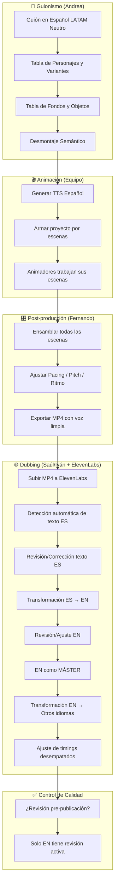
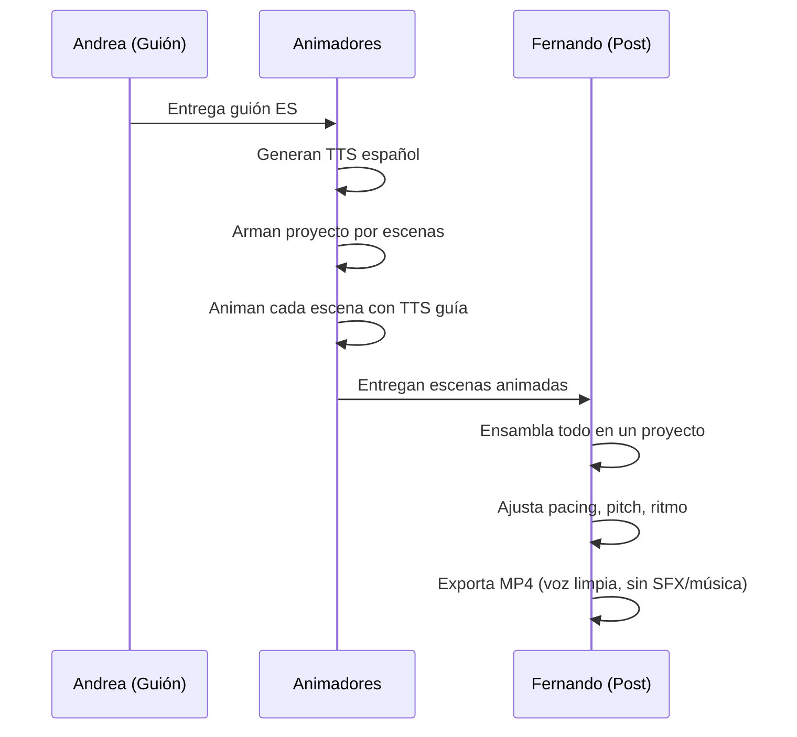
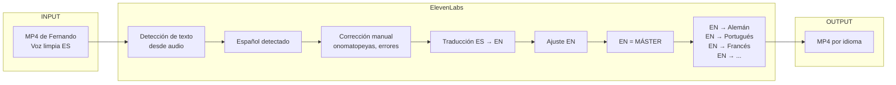

# Flujo Actual de Producción Multi-Idioma

> **Fuente:** Entrevistas equipo de Sitio, Animación y Post (Dic 2025)
> **Estado:** Documentación del proceso "As-Is" - v2

---

## Resumen Ejecutivo

El proceso actual tiene **dos transformaciones obligatorias**:
1. **ES → EN** (español a inglés) - Se valida y ajusta
2. **EN → Resto** (inglés como máster a todos los demás idiomas)

El inglés se convierte en el **"Single Source of Truth"** para las traducciones a otros idiomas.

---

## Diagrama de Flujo (Swimlane)



---

## Fase 1: Escritura del Guión Base (Español LATAM Neutro)

### ¿Por qué Español como lengua madre?
| Beneficio | Descripción |
|-----------|-------------|
| **Ritmo Natural** | Medir tiempos del TTS desde el inicio |
| **Emociones Honestas** | Diálogos orgánicos |
| **Chistes Globales** | Evitar modismos y contexto cultural local |
| **Traducibilidad** | Base limpia para todos los idiomas |

### Reglas de Escritura
- ❌ **EVITAR:** Mexicanismos, argentinismos, doble sentido regional
- ✅ **USAR:** Español neutro/global desde el primer borrador

### Artefactos del Guión (Producidos por Guionista)
| Artefacto | Descripción |
|-----------|-------------|
| **Historia/Desarrollo** | Narrativa completa |
| **Audio (columna)** | TTS texto + diálogos + indicaciones de diseño sonoro |
| **Desarrollo (columna)** | Descripción visual por escena |
| **Notas** | Indicaciones puntuales para diseño sonoro |
| **Nombre Clave** | 1-2 palabras para organizar archivos entre departamentos |
| **Tabla de Personajes** | Descripción + variantes (ej: enfermera con bata limpia vs sangre) |
| **Tabla de Fondos** | Cantidad, día/noche, biblioteca vs nuevo |
| **Tabla de Objetos** | Props que aparecen (automatizado para búsqueda de assets) |

---

## Fase 2: Desmontaje Semántico (Pre-Traducción)

Por cada **escena clave**, antes de traducir se define:

### Intenciones por Personaje
```
[PERSONAJE] | Intención
----------------------------
Narrador    | Neutral, storytime
Personaje A | Ebrio, palabras arrastradas
Personaje B | Susurros, tensión
Personaje C | Gritando, desesperación
```

> [!IMPORTANT]
> **Impacto en Timing:** Las emociones (ebrio, susurro, grito) modifican la longitud real de las frases TTS. Esto obliga a ajustar acciones para mantener coherencia con el tiempo del DTS.

### Ajuste de Timing
- Longitud de frases ajustada al **timing visual** por desarrollo de animación.
- Métrica: Segundos por diálogo vs. duración de escena.

---

## Fase 3: Producción de TTS y Animación

### Proceso Actual (Antes de Dubbing)



> [!NOTE]
> El TTS que se usa para animar **YA tiene el tratamiento de pitch y pacing** antes de llegar a ElevenLabs. No es el texto crudo del guión.

---

## Fase 4: Dubbing Multi-Idioma (ElevenLabs)

### Flujo de las Dos Transformaciones



### Problemas Identificados en Esta Fase

| Problema | Descripción | Frecuencia |
|----------|-------------|------------|
| **Detección incorrecta** | Onomatopeyas (¡ay!), gritos, no se detectan bien | Frecuente |
| **"No" → "Number"** | Palabras simples se malinterpretan | Ocasional |
| **Pronombres mal asignados** | Contexto perdido por solo tener audio | Ocasional |
| **Timings desempatados** | Traducciones no cuadran con escenas | Frecuente |

> [!WARNING]
> **No hay control de calidad formal** para idiomas que no sean Español o Inglés. Se confía en el output de ElevenLabs.

### Roles Actuales
| Rol | Persona | Responsabilidad |
|-----|---------|-----------------|
| Ensamblador Final | Fernando | Junta escenas, ajusta pitch/pacing, exporta MP4 |
| Dubbing Lead | Saúl / Iván | Sube MP4 a ElevenLabs, corrige texto, genera traducciones |
| Revisor | (Saúl/Iván) | Solo revisa EN activamente |

---

## Fase 5: Control de Calidad (Estado Actual)

### Puntos de Validación Actuales
| Punto | ¿Validado? | ¿Quién? | Notas |
|-------|-----------|---------|-------|
| Guión ES aprobado | ✅ | Comité | Antes de producción |
| Texto detectado en ElevenLabs vs Guión original | ⚠️ Parcial | Saúl/Iván | Solo cuando hay errores evidentes |
| Traducción ES → EN | ✅ | Saúl/Iván | Revisión activa |
| Traducción EN → Otros | ❌ | (Nadie) | Se confía en ElevenLabs |
| Timing por escena en otros idiomas | ❌ | (Manual ad-hoc) | Se ajusta cuando "se ve mal" |

### Puntos de Validación Ideales (Pendientes de Implementar)
```
1. Guión ES ←→ Texto detectado (Single Source of Truth)
2. ES → EN (validación semántica + timing)
3. EN → Cada idioma (muestreo + métricas automáticas)
4. Pre-publicación (playback completo)
```

---

## Idiomas Target (17 Total)

| Tier | Idiomas | Estrategia de Revisión |
|------|---------|------------------------|
| **Tier 1 (Prioritarios)** | Inglés, Portugués, Francés, Alemán | 100% revisión humana |
| **Tier 2 (Alto Alcance)** | Árabe, Coreano, Japonés, Hindi, Chino Mandarín | Muestreo de segmentos riesgosos |
| **Tier 3 (Expansión)** | Filipino, Indonesio, Italiano, Ruso, Turco, Tamil, Malay | Solo flagged por métricas |

---

## Artefactos Entregables por Fase

| Fase | Artefacto | Formato | Responsable |
|------|-----------|---------|-------------|
| 1. Guión | Script Neutro | `.docx` / Google Doc | Andrea |
| 2. Desmontaje | Tabla de Intenciones | Tabla en guión | Andrea |
| 3. Animación | Proyecto con TTS | `.aep` / Proyecto | Animadores |
| 4. Post | MP4 voz limpia | `.mp4` | Fernando |
| 5. Dubbing | MP4 por idioma | `.mp4` | Saúl/Iván |

---

## Preguntas Abiertas para Siguientes Entrevistas

Ver **[CUESTIONARIO_DETALLE.md](./research/CUESTIONARIO_DETALLE.md)** para el cuestionario completo de profundización.
