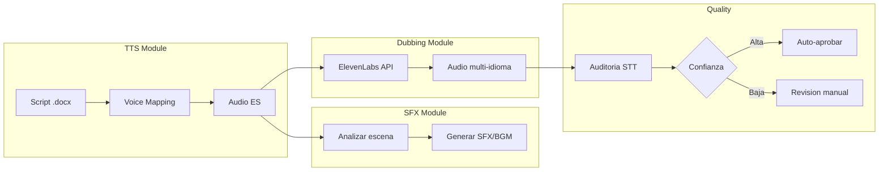

# ElevenLabs Feature Set

> Documentacion centralizada para los modulos de voz y doblaje multi-idioma de AI Studio.

---

## Estructura

| Directorio | Descripcion |
|------------|-------------|
| [`Knowledgebase/`](./Knowledgebase/) | Documentacion tecnica de la API de ElevenLabs |
| [`TTS/`](./TTS/) | Modulo Text-to-Speech (generacion de dialogos) |
| [`Dubbing/`](./Dubbing/) | Modulo multi-idioma (traduccion y doblaje) |
| [`SFX/`](./SFX/) | Modulo de efectos de sonido y musica |
| [`Quality/`](./Quality/) | Sistema de auditoria de calidad |

---

## Flujo de trabajo general

---

## Quick links

### TTS
- [Plan de mejoras TTS](./TTS/PLAN.md)
- [Checklist de produccion](./TTS/CHECKLIST.md)

### SFX (Sonorizacion)
- [Plan de sonorizacion](./SFX/PLAN.md)
- [Checklist SFX](./SFX/CHECKLIST.md)

### Dubbing
- [Master plan dubbing](./Dubbing/02_Planning/MASTER_PLAN.md)
- [Guia es_latam](./Dubbing/03_Assets/guide_es_latam.md)
- [Persona kids 6-12](./Dubbing/03_Assets/persona_kids_6_12.md)
- [Blacklists](./Dubbing/03_Assets/blacklist_global.json)

### Quality
- [Sistema de auditoria](./Quality/VALIDATION_FLOW_TIERING.md)

---

## APIs utilizadas

| API | Uso | Endpoint base |
|-----|-----|---------------|
| **Text-to-Speech** | Generar audio desde texto | `/v1/text-to-speech/{voice_id}` |
| **Studio Projects** | Crear proyectos estructurados | `/v1/studio/projects` |
| **Dubbing** | Doblaje de video/audio | `/v1/dubbing` |
| **Sound Effects** | Generar SFX desde prompt | `/v1/sound-generation` |
| **Speech-to-Text** | Transcripcion para QA | `/v1/speech-to-text` |

---

## Metricas de produccion

| Metrica | Target | Actual |
|---------|--------|--------|
| Tiempo por episodio (manual) | 4-5 hrs | - |
| Tiempo por episodio (automatizado) | 40 min | - |
| Ahorro estimado | 85% | - |
| Idiomas soportados | 17 | - |

---

> Ultima actualizacion: Dec 2024
> Maintainer: Equipo de Produccion REBAN
