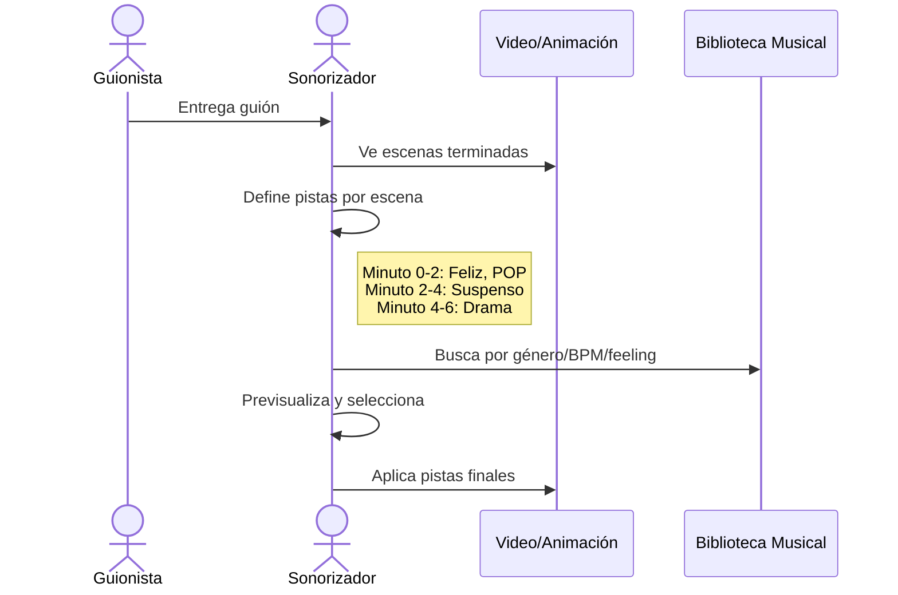
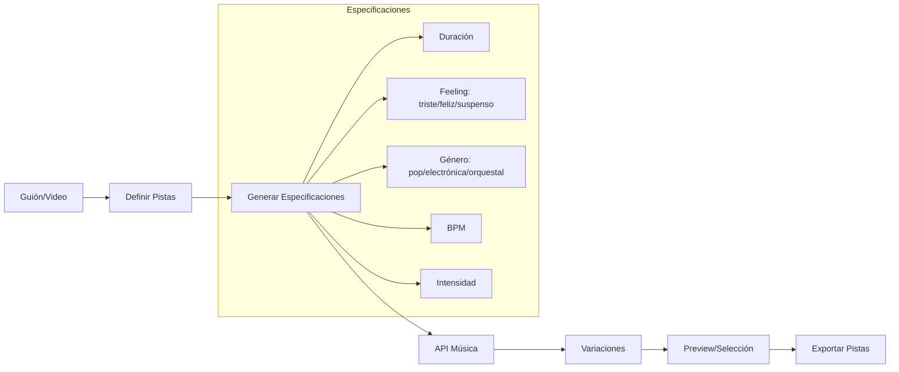

# Módulo Sonorización - Plan de Desarrollo

## Objetivo
Automatizar la generación de música/pistas de fondo para videos animados basándose en un guión, usando APIs de generación musical (Suno, ElevenLabs Music, etc.).

---

## Flujo de Trabajo Actual (Manual)



---

## Propuesta: Flujo Automatizado



---

## Entidades del Sistema

### 1. Proyecto de Sonorización
```
{
  "nombre": "Un Guardaespaldas Escolar",
  "duracion_total": "08:30",
  "pistas": [...]
}
```

### 2. Pista Musical
```
{
  "id": "pista_001",
  "inicio": "00:00",
  "fin": "02:15",
  "escena": "Introducción",
  "especificacion": {
    "feeling": "feliz",
    "genero": "pop 80s",
    "bpm": 120,
    "intensidad": "media",
    "notas": "Música alegre de inicio"
  },
  "variaciones": [...],
  "seleccionada": null
}
```

### 3. Variación
```
{
  "id": "var_001",
  "url": "https://...",
  "duracion": "02:15",
  "generador": "suno",
  "prompt_usado": "...",
  "rating": null
}
```

---

## Endpoints API (Propuesta)

| Método | Endpoint | Descripción |
|--------|----------|-------------|
| POST | `/api/sonorizacion/proyecto` | Crear proyecto desde guión |
| GET | `/api/sonorizacion/proyecto/{id}` | Obtener proyecto |
| POST | `/api/sonorizacion/pista` | Definir nueva pista |
| PUT | `/api/sonorizacion/pista/{id}` | Editar pista |
| POST | `/api/sonorizacion/pista/{id}/generar` | Generar variaciones |
| GET | `/api/sonorizacion/pista/{id}/variaciones` | Listar variaciones |
| POST | `/api/sonorizacion/pista/{id}/seleccionar` | Seleccionar variación final |
| GET | `/api/sonorizacion/proyecto/{id}/exportar` | Exportar todas las pistas |

---

## APIs de Generación Musical

| Proveedor | API | Características |
|-----------|-----|-----------------|
| **Suno** | `api.suno.ai` | Generación por prompt, alta calidad |
| **ElevenLabs** | Music API | Integración con TTS existente |
| **Mubert** | `api.mubert.com` | Música generativa por parámetros |
| **AIVA** | AIVA API | Música orquestal/cinematográfica |

---

## UI Conceptual

### Vista Principal
```
┌─────────────────────────────────────────────────────────────┐
│  📁 Proyecto: Un Guardaespaldas Escolar                     │
├─────────────────────────────────────────────────────────────┤
│  Timeline (08:30)                                           │
│  ├─ 00:00 ─────────────────── 08:30 ─────────────────────┤  │
│  │  [Pista 1: Feliz] [Pista 2: Suspenso] [Pista 3: Drama] │ │
├─────────────────────────────────────────────────────────────┤
│  Pista Seleccionada: #1 "Introducción"                      │
│  ┌─────────────────────────────────────────────────────┐   │
│  │ Feeling: [😊 Feliz ▼]  Género: [Pop 80s ▼]          │   │
│  │ BPM: [120]  Intensidad: [Media ▼]                   │   │
│  │ Duración: 00:00 → 02:15                             │   │
│  │ [🎵 Generar Variaciones]                            │   │
│  └─────────────────────────────────────────────────────┘   │
│                                                             │
│  Variaciones:                                               │
│  ┌──────────┐  ┌──────────┐  ┌──────────┐                  │
│  │ Var 1 ▶️  │  │ Var 2 ▶️  │  │ Var 3 ▶️  │                  │
│  │ [⭐⭐⭐]   │  │ [⭐⭐⭐⭐⭐]│  │ [⭐⭐]    │                  │
│  │ [Usar]   │  │ [Usar ✓] │  │ [Usar]   │                  │
│  └──────────┘  └──────────┘  └──────────┘                  │
└─────────────────────────────────────────────────────────────┘
```

---

## Dependencias

- TTS Module (para timing con diálogos)
- Video/Scene Timeline
- API Key para proveedor de música (Suno/ElevenLabs)

---

## Fases de Desarrollo

### Fase 1: Core
- [ ] Backend: Modelo de datos (Proyecto, Pista, Variación)
- [ ] Backend: Endpoints CRUD básicos
- [ ] Integración con 1 API de música (Suno)

### Fase 2: UI
- [ ] Frontend: Vista de proyecto con timeline
- [ ] Frontend: Editor de pista
- [ ] Frontend: Preview de variaciones

### Fase 3: Integración
- [ ] Sincronización con TTS (timing de diálogos)
- [ ] Exportación de proyecto completo
- [ ] Múltiples proveedores de música
