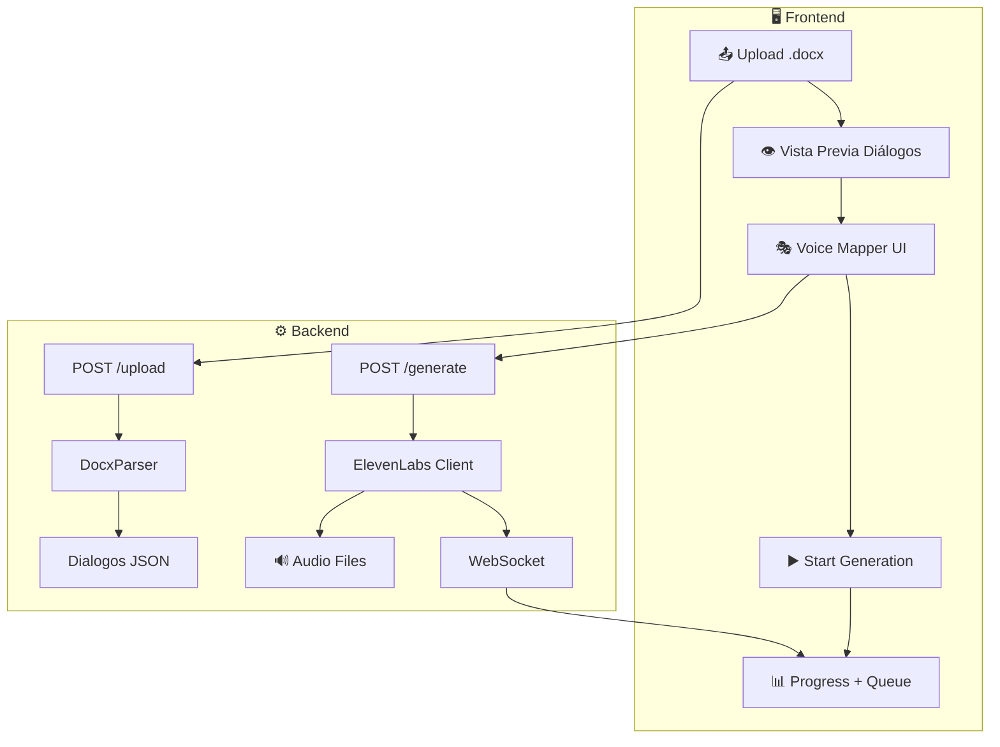

# Voice TTS Module - Plan de Implementación

Nuevo módulo para AI-Studio que automatiza la generación de audio (TTS) para guiones de video usando ElevenLabs API. Integra el proceso actual del usuario (scripts Python) en una GUI moderna.

## Decisiones Pendientes

> [!IMPORTANT]
> **API Key de ElevenLabs**: Definir si la key se guarda en configuración del servidor (`config.py`) o que cada usuario la ingrese en la UI.

---

## Arquitectura



---

## Archivos a Crear/Modificar

### Backend - Services
| Archivo | Descripción |
|---------|-------------|
| `services/elevenlabs.py` | Cliente async para ElevenLabs API |
| `services/docx_parser.py` | Extractor de diálogos desde .docx |

### Backend - API
| Archivo | Descripción |
|---------|-------------|
| `api/voice.py` | Router principal con endpoints |
| `api/models_voice.py` | Modelos Pydantic |
| `api/voice_websocket.py` | WebSocket para progreso |

### Backend - Config
| Archivo | Cambio |
|---------|--------|
| `config.py` | Agregar eleven_labs_api_key, voice_output_folder |
| `main.py` | Registrar router `/api/voice` |

### Frontend
| Archivo | Descripción |
|---------|-------------|
| `app/voice/page.tsx` | Página principal |
| `components/voice/ScriptUploader.tsx` | Dropzone para .docx |
| `components/voice/VoiceMapper.tsx` | Mapeo personaje→voz |
| `components/voice/SceneQueue.tsx` | Cola de generación |
| `components/shared/Header.tsx` | Agregar link a /voice |

---

## Endpoints API

| Endpoint | Método | Descripción |
|----------|--------|-------------|
| `/api/voice/status` | GET | Health check |
| `/api/voice/voices` | GET | Voces disponibles |
| `/api/voice/upload` | POST | Subir .docx |
| `/api/voice/generate` | POST | Iniciar generación |
| `/api/voice/generate/{job_id}` | GET | Status del job |
| `/api/voice/generate/{job_id}` | DELETE | Cancelar job |

---

## UI Layout

```
┌──────────────────────────────────────────────────────────────────────────────────┐
│  🎙️ Z-Voice Studio                                        [📊 Status: Ready]    │
├──────────────────────────────────────────────────────────────────────────────────┤
│                                                                                  │
│  ┌─────────────────────────────┐   ┌───────────────────────────────────────────┐│
│  │  📄 SCRIPT INPUT            │   │  ⚙️ VOICE SETTINGS                        ││
│  │  ┌───────────────────────┐  │   │  🎭 Voice Mapping                         ││
│  │  │   📂 Drop .docx       │  │   │  ┌─────────────────────────────────────┐  ││
│  │  │   or click to upload  │  │   │  │ Cristina   → [Rachel      ▼] 🔊    │  ││
│  │  └───────────────────────┘  │   │  │ Conductor  → [Marcus      ▼] 🔊    │  ││
│  │  📊 Stats                   │   │  └─────────────────────────────────────┘  ││
│  │  ├─ 🎬 Escenas: 45          │   │  [💾 Save Mapping] [📂 Load JSON]         ││
│  │  └─ 💬 Diálogos: 328        │   │  [▶️ Generate All] [⏹ Stop]               ││
│  └─────────────────────────────┘   └───────────────────────────────────────────┘│
│  ┌──────────────────────────────────────────────────────────────────────────────┐│
│  │ 📋 GENERATION QUEUE                                                          ││
│  ├──────────┬───────────┬────────────┬──────────────┬──────────────────────────┤│
│  │ Escena   │ Líneas    │ Status     │ Progress     │ Actions                  ││
│  └──────────┴───────────┴────────────┴──────────────┴──────────────────────────┘│
└──────────────────────────────────────────────────────────────────────────────────┘
```

---

## Fases de Implementación

### Fase 1 - MVP (~10h)
- Flujo básico: upload → mapeo → generación por escena
- WebSocket para progreso
- Descarga de audios

### Fase 2 - Generación por Personaje (~6h)
- 3 modos: Por Escena | Por Personaje | Híbrido
- Speed/Pitch por personaje
- Merge automático a escenas

### Fase 3 - Preview + Costo (~2h)
- Vista previa texto
- Estimación de costo ElevenLabs

**Total: ~18h**
